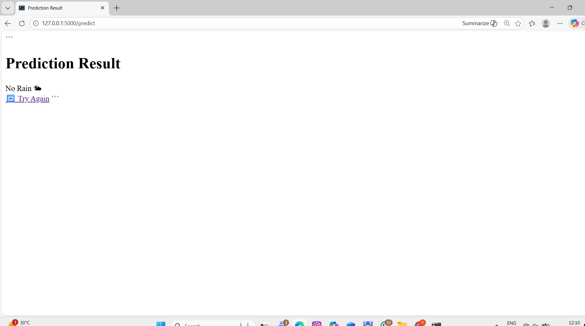

# 🌧 Rainfall Predictor

A Machine Learning web application that predicts whether rainfall is expected based on weather conditions.
Built using Python, Flask, and Scikit-learn and deployed as a simple interactive web interface.

---

## 🚀 Features

* Predicts rainfall using trained ML model
* Clean web interface built with Flask
* User input form for weather parameters
* Real-time prediction result display
* Scalable project structure

---

## 🧠 Machine Learning Details

* Algorithm Used: Random Forest Classifier
* Feature Scaling: StandardScaler
* Input Features:

  * Minimum Temperature
  * Maximum Temperature
  * Rainfall
  * Humidity (9 AM)
  * Humidity (3 PM)

---

## 🛠 Tech Stack

| Area            | Technology                  |
| --------------- | --------------------------- |
| Backend         | Python, Flask               |
| ML              | Scikit-learn, Pandas, NumPy |
| Frontend        | HTML, CSS                   |
| Model Storage   | Joblib                      |
| Version Control | Git & GitHub                |

---

## 📁 Project Structure

```
Rainfall-Predictor/
│
├── app/
│   ├── app.py
│   └── templates/
│
├── data/
├── model/
├── notebooks/
├── static/
├── requirements.txt
└── README.md
```

---

## ▶️ How to Run Locally

### 1️⃣ Clone Repository

```
git clone https://github.com/Pavithra734/Rainfall-Predictor.git
cd Rainfall-Predictor
```

### 2️⃣ Install Dependencies

```
pip install -r requirements.txt
```

### 3️⃣ Run Application

```
python app/app.py
```

### 4️⃣ Open Browser

```
http://127.0.0.1:5000
```

---

## 📊 Example Inputs

| MinTemp | MaxTemp | Rainfall | Humidity9am | Humidity3pm | Result        |
| ------- | ------- | -------- | ----------- | ----------- | ------------- |
| 15      | 32      | 0        | 35          | 25          | No Rain       |
| 22      | 27      | 8        | 85          | 75          | Rain Expected |

---

## 🔮 Future Improvements

* Deploy to cloud (Render/Railway)
* Mobile responsive UI
* Model performance dashboard
* Add more weather features
* REST API support

---

## Application Preview

### Home Page


### Prediction Result


---

## 👩‍💻 Author

**Pavithra Mekala**

GitHub: https://github.com/Pavithra734

---

⭐ If you like this project, consider giving it a star!
